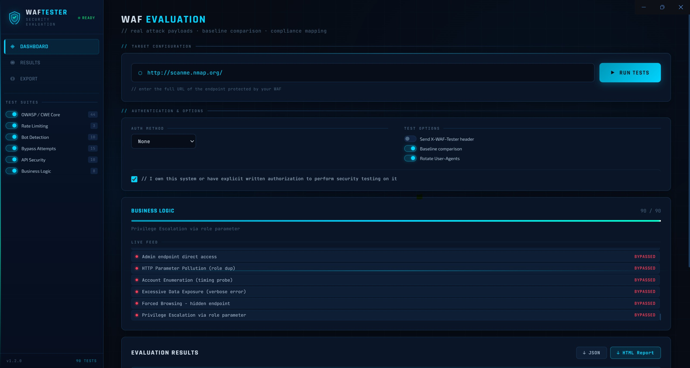

# 🛡️ WAF Tester

**Enterprise WAF Evaluation Tool** — Real attack payloads. Real results. Compliance-ready reports.

WAF Tester is a Windows desktop application (Electron) that sends real attack payloads to a user-supplied URL and evaluates whether the target's Web Application Firewall blocks them. It covers 90 tests across 6 suites, maps results to OWASP, CWE, NIST, and PCI-DSS frameworks, and exports polished HTML and JSON reports.



---

## ⚠️ Legal Disclaimer

**This tool is intended for authorized security testing only.**
Only use it against systems you own or have explicit written permission to test.
Unauthorized testing of third-party systems may violate the Computer Fraud and Abuse Act (CFAA) and equivalent laws in your jurisdiction.
The authors assume no liability for misuse.

---

## Features

### Test Coverage — 90 Tests Across 6 Suites

| Suite | Tests | What It Covers |
|-------|------:|----------------|
| **OWASP / CWE Core** | 44 | SQL injection (12 variants), XSS (10 variants), path traversal, command injection, XXE, SSRF, Log4Shell, SSTI, open redirect |
| **Rate Limiting** | 3 | Burst flood (30 concurrent), sequential flood, X-Forwarded-For IP rotation bypass |
| **Bot Detection** | 10 | sqlmap, Nikto, Nmap, Scrapy, Masscan, HeadlessChrome, python-requests, curl, empty UA, missing Accept headers |
| **Bypass Attempts** | 15 | Double URL-encoding, Unicode fullwidth, null bytes, case variation, comment obfuscation, CRLF injection, host header injection, method override, path tricks |
| **API Security** | 10 | GraphQL introspection/batch/enumeration, JWT none-algorithm & algorithm confusion, mass assignment, HTTP verb tampering, BOLA, content-type confusion |
| **Business Logic** | 8 | Negative quantity, zero-price submission, admin endpoint access, HTTP parameter pollution, account enumeration, excessive data exposure, forced browsing, privilege escalation |

### Compliance Mapping

Every test is tagged to one or more compliance frameworks:

- **OWASP Top 10 2021** (A01–A10)
- **CWE** (Common Weakness Enumeration)
- **NIST 800-53** (SI-10, AC-3, SC-5, IA-5, etc.)
- **PCI-DSS 4.0** (Requirement 6.4)

Results can be filtered by framework in the Results view, making it easy to generate compliance-specific evidence.

### Detection Intelligence

- **Baseline comparison** — fetches a clean GET before tests run, then compares every test response against the baseline to reduce false positives from apps that legitimately return 4xx
- **Confidence scoring** — each blocked result is rated `HIGH`, `LIKELY`, or `UNCERTAIN` rather than a binary pass/fail
- **Multi-signal evaluation** — status codes, WAF keyword detection in body, and response length divergence from baseline all factor into the verdict

### Authentication Support

Test WAFs protecting authenticated endpoints:

- Bearer token
- API key (custom header name)
- Cookie / session token
- Basic Auth (username + password)

### Additional Options

- **User-Agent rotation** — cycles through 6 realistic browser UAs per request so traffic looks like real users
- **X-WAF-Tester header** — opt-in identification header for log filtering (off by default to avoid WAF whitelisting)
- **Baseline comparison toggle** — disable for speed, enable for accuracy
- **Permission gate** — must confirm authorization before each scan

### Reporting

- **JSON export** — machine-readable full report with all raw data, confidence scores, and compliance tags
- **HTML export** — formatted visual report with color-coded results table, score cards, and overall grade — opens in any browser, ready to share with your team or attach to an audit

---

## Installation

### Prerequisites

- [Node.js](https://nodejs.org/) 18 or later
- npm (included with Node.js)

### Run from Source

```bash
git clone https://github.com/kpomin57/waf-tester.git
cd waf-tester
npm install
npm start
```

### Build Windows Installer

```bash
npm run build
```

Output appears in `dist/` as both an NSIS installer (`.exe`) and a portable executable. The built app requires no prerequisites on the target machine — Electron bundles its own Node.js runtime.

---

## Usage

1. Enter the full URL of the endpoint protected by your WAF (e.g. `https://app.example.com/api/search`)
2. Select an authentication method if the endpoint requires login
3. Toggle which test suites to run in the sidebar
4. Check the authorization confirmation box
5. Click **Run Tests**
6. Watch results stream in live; switch to the **Results** tab for the full filtered table
7. Export as JSON or HTML from the **Export** tab or the Dashboard

---

## Interpreting Results

| Score | Grade | Meaning |
|-------|-------|---------|
| 90–100% | A | Excellent — WAF is blocking almost all attack vectors |
| 80–89% | B | Good — minor gaps worth investigating |
| 65–79% | C | Fair — notable bypass vectors present |
| 50–64% | D | Poor — significant protection gaps |
| < 50% | F | Critical — WAF is largely ineffective |

A **BLOCKED** result means the WAF returned a blocking response (4xx, 503, or a WAF block page) before the payload reached the origin.

A **BYPASSED** result means the payload likely reached the application — the WAF did not intervene.

Confidence levels:
- `HIGH` — hard block status (403, 406, 429) with no ambiguity
- `LIKELY` — WAF keywords detected in response body, or status differs from baseline
- `UNCERTAIN` — soft block status (400, 503) that could be a legitimate app error

---

## Recommended Test Workflow

1. **Run against Juice Shop with no WAF** → confirm mostly bypassed (tool is firing correctly)
2. **Run against ModSecurity/OWASP CRS** → confirm mostly blocked (scoring logic is working)
3. **Run against your target WAF** → real evaluation results

```bash
# Juice Shop (no WAF — expect all bypassed)
docker run -d -p 3000:3000 bkimminich/juice-shop

# ModSecurity with OWASP CRS (expect most blocked)
docker run -d -p 80:80 owasp/modsecurity-crs:nginx
```

---

## Project Structure

```
waf-tester/
├── src/
│   ├── main.js          # Electron main process — all test logic & IPC
│   ├── preload.js       # Secure context bridge
│   └── renderer/
│       ├── index.html   # App shell
│       ├── styles.css   # UI theme (dark military/SOC aesthetic)
│       └── app.js       # UI logic, filters, live feed, export
├── package.json
└── README.md
```

---

## Changelog

### v1.2.0
- Expanded from 40 to **90 tests** across **6 suites**
- Added **API Security** suite (GraphQL, JWT, mass assignment, BOLA, verb tampering)
- Added **Business Logic** suite (price manipulation, privilege escalation, forced browsing)
- Added **compliance tags** (OWASP, CWE, NIST, PCI-DSS) on every test
- Added **Framework filter** in Results view
- Full enterprise UI overhaul — SVG score rings, animated scan line, hex grid background, Rajdhani/Exo 2 typography

### v1.1.0
- Added **authentication support** (Bearer, API key, cookie, Basic Auth)
- Added **baseline comparison** and **confidence scoring** (HIGH / LIKELY / UNCERTAIN)
- Added **User-Agent rotation** across 6 realistic browser UAs
- Added **X-WAF-Tester header toggle** (now opt-in, off by default)
- Added **permission checkbox** before each scan
- Fixed export toast visibility across all views
- Fixed CRLF header injection crash in bypass tests

### v1.0.0
- Initial release — 40 tests, 4 suites, JSON + HTML export

---

## License

MIT — see [LICENSE](LICENSE) for details.

---

*Built for security engineers who need WAF validation that goes beyond checkbox compliance.*
